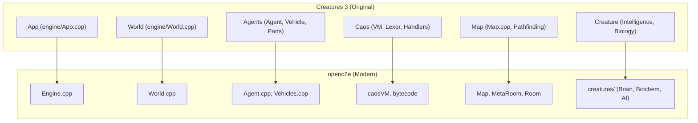

# Creatures 3 → openc2e: Master Migration Plan

This document serves as the authoritative guide for migrating behavioral logic and architectural patterns from the original Creatures 3 (C3) into the modern openc2e engine. 

> [!NOTE]
> This is a living document. As we complete phases and discover new complexities, we will update the strategies and priorities accordingly.

---

## 🏗️ Architectural Mapping

Our goal is behavioral parity. We achieve this by mapping original C3 components to their modern openc2e equivalents and filling the identified "logic gaps."

---

## 🗺️ Roadmap: The 8 Phases

Each phase is designed to build upon the stability of the previous one.

### Phase 1: CAOS Virtual Machine (Status: COMPLETE ✅)
*   **Focus**: Parity of the scripting engine.
*   **Audit Findings**: 141 missing commands, 74 stubbed. High gaps in `BRN:`, `GENE:`, and `HIST:`.
*   **Next Step**: Implementation of these missing handlers will occur during their respective subsystem phases.

### Phase 2: Agent System (Status: COMPLETE ✅)
*   **Focus**: Filling the ~30KB logic gap in `Agent.cpp`.
*   **Critical Gaps**:
    *   **Movement & Collision**: Original C3 logic for agent physics and "bump" behavior.
    *   **Port Connectivity**: Fully implementing `PortBundle` and inter-agent synchronization.
    *   **Vehicles**: "Greedy cabin" logic and advanced containment.

### Phase 3: Creature System (Status: COMPLETE ✅)
*   **Focus**: Implementation of cortical logic and physiological simulation.
*   **Sub-components**:
    *   **Brain (`BRN:`)**: Porting neuro-update formulas from `Tract.cpp` (35KB) and `Lobe.cpp`.
    *   **Biochemistry**: Aligning reaction rates, chemical decay, and organ interactions.
    *   **Faculties**: Sensory (perception), Linguistic (word recognition), and Motor (brain-driven action).
    *   **Skeleton**: Porting 103KB of animation and pose logic (the largest mechanical gap).

### Phase 4: Map & World Geometry
*   **Focus**: The highest mechanical priority outside AI.
*   **Challenge**: The C3 `Map.cpp` is 214KB vs openc2e's 10KB.
*   **Logic to Port**: Cellular Automata (CA) for heat/nutrients, pathfinding graphs, and room-link navigation.

### Phase 5: Display & Rendering Logic
*   **Focus**: Handling camera kinematics and world aesthetics.
*   **Logic to Port**: Smooth scrolling, multi-viewport tracking, and the `TintManager` for environmental lighting effects.

### Phase 6: Sound & Music Engine
*   **Focus**: The MNG (Dynamic Music) expression language.
*   **Logic to Port**: Mood-based track blending, fading, and layering logic from `MusicManager.cpp`.

### Phase 7: Serialization (Save/Load)
*   **Focus**: Ensuring world persistence is robust and matches C3's internal state.
*   **Logic to Port**: MFC-style serialization mappings and the "Flight Recorder" for error tracing.

### Phase 8: Infrastructure & Multi-language Support
*   **Focus**: Final polish, registry handling, and PRAY tool parity.

---

## 📉 Critical Logic Gaps (Metric: File Size & Complexity)

We track progress by bridging the code-size difference between the original and modern implementations.

| Component | C3 Size | openc2e Size | Gap | Priority |
| :--- | :--- | :--- | :--- | :--- |
| **Map System** | 238KB | 20KB | **218KB** | 🔴 Critical |
| **Skeleton/Body** | 103KB | 25KB | **78KB** | 🔴 Critical |
| **Agent Base** | 75KB | 43KB | **32KB** | 🔴 Critical |
| **CAOS VM** | 145KB | Generated | **Variable** | ✅ Verified |

---

## ✅ Verification Protocol

For every component migrated, we follow this verified lifecycle:
1.  **Code Audit**: Side-by-side comparison of original and modern handlers.
2.  **Unit Tests**: Use `gtest` (e.g., `VoiceDataTest.cpp`) to verify implementation bounds.
3.  **CAOS Integration**: Run `ctest` with actual CAOS scripts.
4.  **Live Run**: Launch the engine with Docking Station data to verify visual/interactive parity.

---
*Created on: 2026-02-21*
*Approved by: USER*
